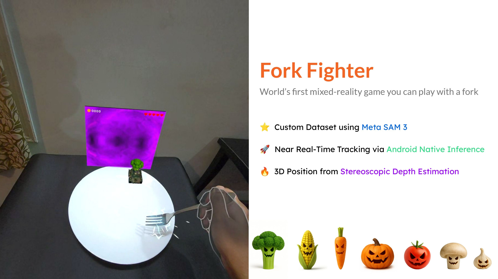
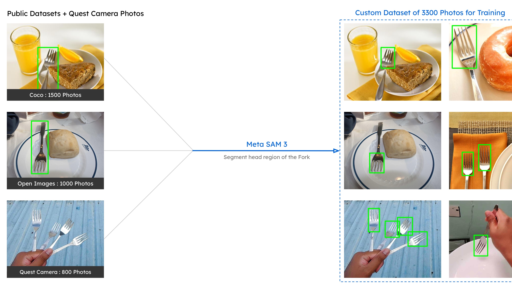
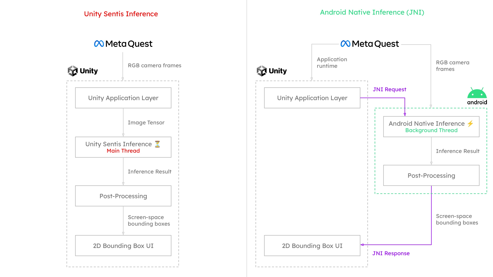
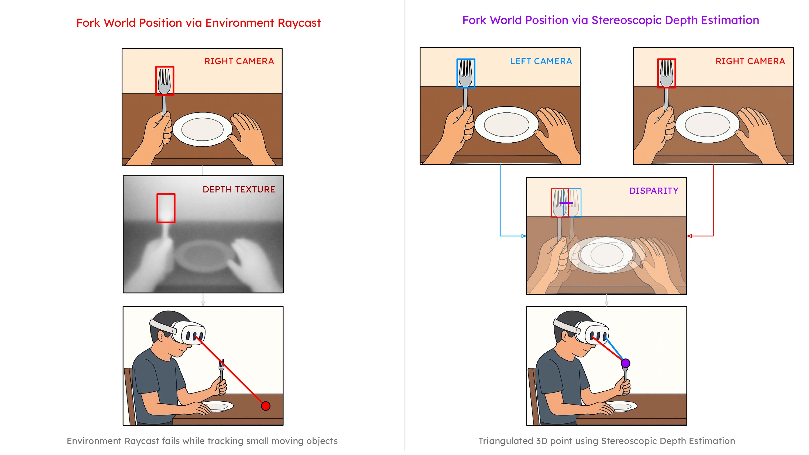

# Fork-Fighter



The world’s first mixed-reality game you can play with a real fork.  **[ Try It on Meta Quest 3  🚀](https://www.meta.com/s/iTX1PGbdd)**

## Overview  
Fork Fighter transforms an ordinary plate and a real fork into a mixed-reality battlefield where invading vegetables roll in on tiny tanks and attack the player. Built for Meta Quest mixed reality, it combines physical interaction, fast computer-vision tracking, and clever technical workarounds to demonstrate how everyday objects can become powerful game interfaces.

This repository contains the full open-source project—including the tracking system, mixed-reality gameplay logic, and supporting tools—so developers can explore, learn, and extend the experience.

## 🗂️ Project Structure  
```text
/Fork-Fighter
    /Android
        📦 JNI.aar
        /myplugin/src/main
            /assets
                🧠 fork_yolo11n_custom.onnx
                🧠 plate_yolo11n.onnx
            /java/com/example/myplugin
                📄 MyPlugin.java

    Unity
        /Assets
            /Scripts
                📄 QuestCameraBridge.cs
            /Scenes
                🎮 GameScene.unity

    📓 YOLO11n Training Notebook for Meta Quest3.ipynb
```

## 🧠 Key Technical Innovations  

### 1. Custom Fork-Head Dataset for Model Training  


To track the fork accurately, a unified dataset was built from:

- COCO  
- Open Images  
- Custom Quest-captured images  

Most datasets label the entire fork, but the game requires precision: **only the fork’s head**. Retagging thousands of images manually would have been slow—until **Meta’s SAM 3** enabled fast, high-quality segmentation tailored to the project.

---

### 2. Near Real-Time Tracking at 72 FPS  


To achieve smooth, low-latency performance, object detection runs through **Android JNI** rather than Unity Sentis, providing:

- Lower latency  
- Tight control over execution  
- Access to hardware acceleration  

Detection uses a compact **single-class YOLO11n** model, optimized for speed and minimal overhead.

---

### 3. Stereo-Vision Depth Without Hit Testing


Small, fast-moving tools like forks don't work reliably with platform hit tests, so the project uses a custom stereo-vision approach:

- JNI runs inference on the left and right camera streams in parallel  
- Detections are aligned  
- Depth is calculated from disparity  
- The fork’s 3D position is estimated with consistent accuracy  

This enables stable tracking even during rapid motion.

## 🎮 Gameplay Summary  
**1. Plate Detected → Experience Begins**  
When a plate is recognized in front of the player, a virtual red chilli appears at its center. Stab it with a real fork to open the portal.

**2. Enemies Enter the Arena**  
Vegetables emerge on miniature tanks, firing paint-ball rounds that splatter across the player’s view. The more hits you take, the more your vision is obscured.

**3. The Fork as a Controller**  
Using a real fork adds natural tactile feedback—weight, resistance, and grip—creating immersion no traditional controller can match.

**4. Escalation & Survival**  
If an enemy reaches the edge of the plate, it leaps toward the headset and distorts the view. Waves grow harder over time. Survive as long as possible.


## 🚀 Getting Started  

### Requirements  
- Meta Quest device (Quest 3 recommended)  
- Unity 6000.2.11f1
- Android NDK for JNI builds  

### Setup  
1. Clone the repository:  
   ```bash
   git clone https://github.com/your-org/fork-fighter.git
2. Open the project in Unity.  
3. Build to a Quest device.  
4. Point the headset at a plate, grab a fork, and begin.


## 🧪 Model Training Pipeline  

This repository provides a **single Google Colab notebook** covering the complete training and export flow:

- Installing required dependencies  
- Downloading a Roboflow dataset  
- Training a YOLO11n single-class detector  
- Exporting the model to ONNX for Android JNI inference  
- Using the exported model in a Unity (Quest 3) pipeline  

👉 **[Open the Training Notebook in Google Colab](https://colab.research.google.com/github/NithnShankr/Fork-Fighter/blob/main/YOLO11n%20Training%20Notebook%20for%20Meta%20Quest3.ipynb)**


## 🔮 Why This Project Matters  
Fork Fighter started with a bold question:  
**Can everyday objects become powerful mixed-reality interfaces?**

The techniques developed in this project open doors for:

- Tangible MR interfaces  
- Spatial productivity tools  
- Physical-object tracking systems  
- Experimental MR gameplay  
- Accessible interaction models  

Fork Fighter is open-source to inspire experimentation. Use it, break it, improve it—  
and yes, **fork it**.

---

## 🤝 Contributing  
Contributions are welcome!  
Open issues, submit pull requests, or propose enhancements.

---

## 📜 License  
Released under the MIT License.  
See the `LICENSE` file for details.

---

## 🥄 Fork the Repo  
Explore the code, learn from the techniques, and build something entirely new.  
Mixed reality belongs to the experimenters—go create.
